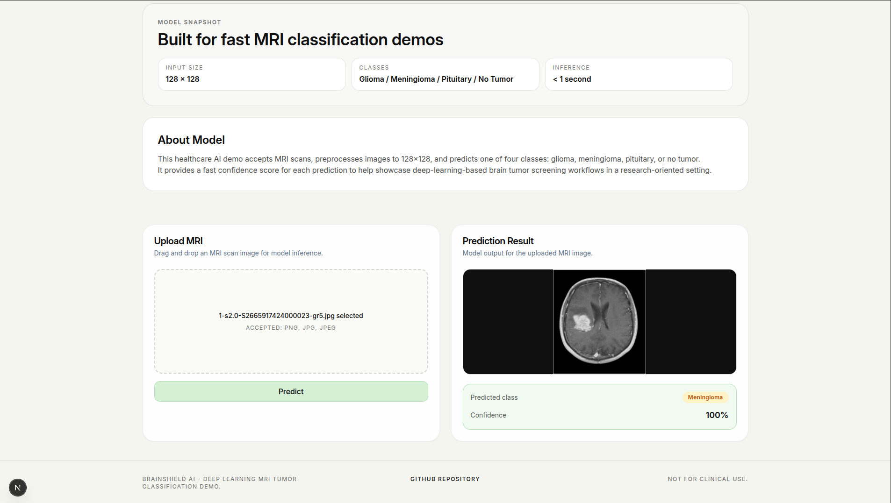

# Brain Tumor Detection using Deep Learning

End-to-end brain MRI classification app with:

- **Frontend:** Next.js 15 + React 19 (`client/`)
- **Backend:** Flask + TensorFlow/Keras API (`server/`)

Users upload an MRI image and receive a prediction for:

- `glioma`
- `meningioma`
- `pituitary`
- `notumor`

## Screenshots




## Model Training

- Dataset: [Brain Tumor MRI Dataset (Kaggle)](https://www.kaggle.com/datasets/masoudnickparvar/brain-tumor-mri-dataset)
- Training notebook: `server/models/brain-tumor-detection.ipynb`
- Training hardware: **GPU** (not CPU)
- GPU details: NVIDIA GeForce RTX 2050 (4GB VRAM), Driver 580.126.20, CUDA 13.0

## Model Details

- Architecture: Transfer learning with `VGG16` (`include_top=False`, `weights="imagenet"`)
- Input size: `128 x 128 x 3`
- Fine-tuning: all VGG16 layers frozen, then last 3 layers unfrozen
- Classification head: `Flatten -> Dropout(0.3) -> Dense(128, relu) -> Dropout(0.2) -> Dense(4, softmax)`
- Training setup: `Adam(learning_rate=1e-4)`, `sparse_categorical_crossentropy`, metric `sparse_categorical_accuracy`, `batch_size=20`, `epochs=5`
- Notebook-reported data volume: `5600` train images and `1600` test images (4 classes)
- Notebook-reported metrics: test accuracy `0.92` (macro F1 `0.92`), with training accuracy reaching ~`97.39%` in the main run

## What this project includes

- MRI upload UI with instant image preview
- Backend image classification endpoint (`POST /api/predict`)
- Client-aware upload cleanup using `X-Client-Id`
- Automatic uploaded-file deletion after configurable TTL
- Render blueprint for deploying server and client together

## Repository structure

```text
brain-tumor-detection/
├── package.json             # Root scripts (client + server)
├── client/                  # Next.js frontend
│   ├── app/
│   ├── components/
│   ├── public/
│   └── .env.example
├── server/                  # Flask + TensorFlow backend
│   ├── main.py
│   ├── wsgi.py
│   ├── requirements.txt
│   ├── models/
│   │   ├── best_model.keras
│   │   └── labels.npy
│   ├── uploads/
│   └── .env.example
├── render.yaml
├── DEPLOYMENT.md
└── README.md
```

## Tech stack

- Frontend: Next.js, React, TypeScript, Tailwind CSS
- Backend: Flask, TensorFlow/Keras, NumPy, Gunicorn
- Runtime tooling: npm scripts + Python virtual environment

## Prerequisites

- Node.js 20+
- npm
- Python 3.12+

## Quick start (recommended)

From the repository root:

```bash
npm run setup
cp server/.env.example server/.env
cp client/.env.example client/.env.local
npm run start
```

This starts:

- Backend at `http://127.0.0.1:5000`
- Frontend at `http://localhost:3000`

> `npm run start` is local-friendly: it starts the frontend in dev mode and starts the backend with `gunicorn` if available, otherwise falls back to Flask.

## Run commands (root)

```bash
# Install dependencies for both services
npm run setup

# Local full-stack run (best for development)
npm run start

# Alternative dev alias (same behavior style)
npm run dev

# Build frontend only
npm run build

# Production-style startup (requires gunicorn installed in server .venv)
npm run start:prod
```

## Manual setup (service-by-service)

### Backend (Flask + TensorFlow)

```bash
cd server
python3 -m venv .venv
source .venv/bin/activate
pip install -r requirements.txt
cp .env.example .env
python main.py
```

### Frontend (Next.js)

```bash
cd client
npm install
cp .env.example .env.local
npm run dev
```

## Environment variables

### Server (`server/.env`)

<table>
  <thead>
    <tr>
      <th>Variable</th>
      <th>Default</th>
      <th>Purpose</th>
    </tr>
  </thead>
  <tbody>
    <tr>
      <td><code>PORT</code></td>
      <td><code>5000</code></td>
      <td>API bind port</td>
    </tr>
    <tr>
      <td><code>FLASK_DEBUG</code></td>
      <td><code>0</code></td>
      <td>Flask debug mode (<code>1</code> to enable)</td>
    </tr>
    <tr>
      <td><code>CLIENT_ORIGIN</code></td>
      <td><code>http://localhost:3000</code></td>
      <td>CORS allow-origin for frontend</td>
    </tr>
    <tr>
      <td><code>UPLOAD_TTL_SECONDS</code></td>
      <td><code>60</code></td>
      <td>Time before uploaded files are auto-deleted</td>
    </tr>
    <tr>
      <td><code>UPLOAD_CLEANUP_INTERVAL_SECONDS</code></td>
      <td><code>15</code></td>
      <td>Background sweep interval for expired files</td>
    </tr>
  </tbody>
</table>

### Client (`client/.env.local`)

<table>
  <thead>
    <tr>
      <th>Variable</th>
      <th>Default</th>
      <th>Purpose</th>
    </tr>
  </thead>
  <tbody>
    <tr>
      <td><code>NEXT_PUBLIC_API_BASE_URL</code></td>
      <td><code>http://127.0.0.1:5000</code></td>
      <td>Base URL used by frontend API requests</td>
    </tr>
  </tbody>
</table>

## API reference

Base URL (local): `http://127.0.0.1:5000`

### `GET /`

Basic API metadata.

Example:

```json
{
    "message": "Brain tumor detection API is running.",
    "predict_endpoint": "/api/predict"
}
```

### `POST /api/predict`

Run prediction on an uploaded MRI image.

- Method: `POST`
- Content type: `multipart/form-data`
- File field: `file`
- Allowed extensions: `.jpg`, `.jpeg`, `.png`
- Max payload: `10MB`
- Optional header: `X-Client-Id` (used for per-user upload cleanup)

Success response:

```json
{
    "predictedClass": "meningioma",
    "displayClass": "Meningioma",
    "confidence": 80.68,
    "filename": "<clientId>__<uuid>_image.jpg"
}
```

Common error responses:

- `400` missing file / invalid type
- `413` file too large
- `500` prediction failed

### Example `curl`

```bash
curl -X POST "http://127.0.0.1:5000/api/predict" \
  -H "X-Client-Id: test-client" \
  -F "file=@/path/to/mri-image.jpg"
```

## Upload retention behavior

For each upload request:

1. Backend identifies user via `X-Client-Id` (or fallback fingerprint).
2. Previous files for that client are removed.
3. New file is saved and inference is executed.
4. File is scheduled for deletion after `UPLOAD_TTL_SECONDS`.
5. Periodic cleanup also removes expired files.

This keeps storage bounded with no manual cleanup needed.

## Production notes

- Server production entrypoint: `gunicorn wsgi:app --bind 0.0.0.0:$PORT --timeout 300`
- Frontend production requires build artifacts (`next build` before `next start`)
- Root `npm run start:prod` performs frontend build then starts both services
- Keep `CLIENT_ORIGIN` and `NEXT_PUBLIC_API_BASE_URL` aligned for CORS and API calls

Detailed deployment steps: [DEPLOYMENT.md](DEPLOYMENT.md)


### TensorFlow GPU log messages on startup

Informational TensorFlow initialization logs are expected and are not startup failures by themselves.
